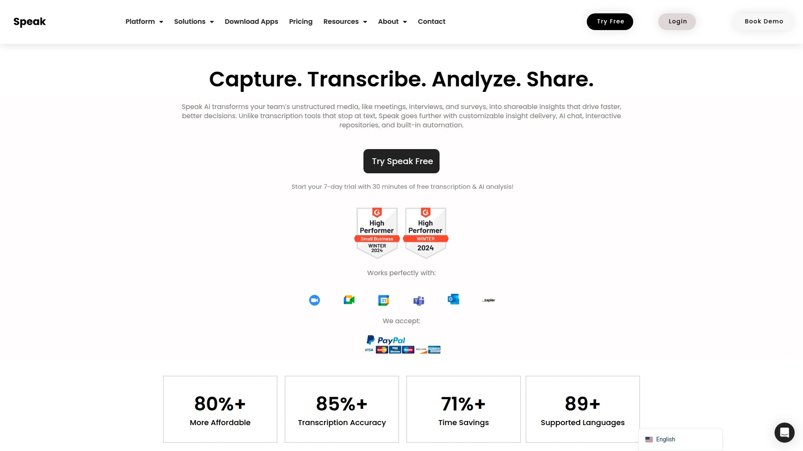
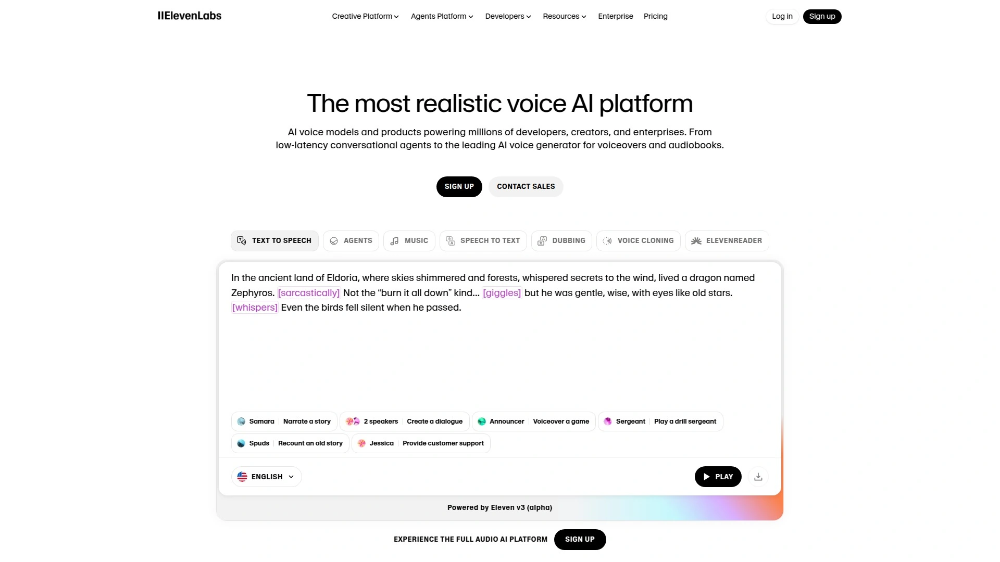

# 2025年排名前18的AI转录工具汇总（最新整理）

无论你是需要整理会议纪要的团队管理者、制作课程字幕的内容创作者，还是处理访谈录音的研究人员，AI转录工具都能大幅提升工作效率。传统的手动转录不仅耗时费力，还容易出错。而现代AI语音转文字技术可在几分钟内完成转录、自动识别说话人、生成会议摘要，甚至支持多语言翻译。本文精选了18款经过实际验证的AI转录与会议分析工具，涵盖实时转录、视频字幕、质性研究分析等多元场景，帮助你快速找到最适合团队需求的解决方案。

---

## **[Speak AI](https://speakai.co)**

全方位AI媒体分析平台，专为质性研究与团队协作设计。

Speak AI不仅提供音视频转文字服务，更将非结构化数据转化为可共享的洞察报告。与单纯的转录工具不同，它内置了AI聊天分析、可定制的洞察交付系统、以及自动化工作流，让研究团队能够跨所有会议和调研数据进行全局搜索与模式识别。

**核心优势：**
- 自动选择最优AI模型，无需手动切换即可保持最佳性能
- 支持会议、访谈、调研问卷等多数据源整合分析
- 提供带品牌定制的知识库，支持团队权限管理与永久存储
- 加拿大公司，符合数据主权与企业级安全协议
- 多语言支持及网页抓取工具，适合全球化团队

**适用场景：** 特别适合用户研究团队、市场调研机构、需要深度挖掘定性数据的专业人士。7天免费试用包含30分钟转录与AI分析额度，企业用户可获得专属培训支持。

***

## **[Speechify](https://speechify.com)**

全球领先的文字转语音与AI配音平台，月活用户超5000万。

凭借超过50万条五星好评，Speechify不仅能将任何文本即时转换为自然语音，还提供强大的AI配音工作室功能。支持60多种语言与多种地区口音，提供1000多种AI语音选项以及语音克隆技术。其跨平台特性（iOS、Android、Chrome扩展、网页版）使内容创作者能在任何设备上无缝工作。

平台亮点包括即时翻译、OCR图像转语音、自然语言处理技术，以及对阅读障碍用户的友好支持。2025年荣获苹果设计奖，被评为年度Chrome扩展应用。

**定价模式：** 提供免费版本，高级TTS订阅、AI配音工作室基础版与专业版满足不同创作需求。

***

## **[Notta](https://notta.ai)**

实时转录与AI摘要的全能会议助手，支持150+语言。

Notta以其快速准确的转录能力著称，能在会议进行时提供实时字幕，并在会后自动生成结构化摘要。平台支持上传音视频文件、导入CSV调研数据，甚至可通过Zapier集成实现自动化工作流。其视频摘要器与音频翻译器让跨语言团队协作变得轻松高效。

**功能特色：**
- 会议助手可加入Zoom、Google Meet、Microsoft Teams进行实时记录
- 智能话题标签与说话人识别
- 可搜索的会议资料库，方便历史记录查询
- 移动端APP支持随时随地转录

提供免费套餐，付费计划从每月$16.99起，Business计划每用户$40/月适合大型团队。30天Cookie追踪确保用户获得完整体验。

***

## **[Otter.ai](https://otter.ai)**

市场占有率最高的会议转录工具，实时协作功能强大。

Otter.ai的免费版本提供每月300分钟转录额度，远超大多数竞品。它可以实时加入Zoom、Google Meet、Microsoft Teams会议，自动生成带时间戳的完整记录，并支持团队成员在转录文本上添加评论、标记重点、分配任务。

**实用特性：**
- 实时转录准确率达80-95%
- 自动生成会议摘要与行动项
- 跨平台支持（网页、Chrome扩展、iOS/Android应用）
- 共享词汇表功能让专业术语识别更精准
- Pro计划提供1200分钟/月转录额度，仅$16.99

适合个人用户及中小型团队日常会议记录需求，企业版提供更高配额与团队管理功能。

***

## **[Fireflies.ai](https://fireflies.ai)**

CRM深度集成的销售团队专属会议助手。

Fireflies.ai不仅能录制和转录会议，更能自动将关键信息同步至Salesforce、HubSpot等CRM系统。其对话智能分析功能可识别客户异议、竞品提及、痛点话题等销售关键信息，并生成可视化仪表板帮助销售经理追踪团队表现。

支持自动语言检测、多说话人识别，以及跨会议的全局搜索。销售培训场景下，可通过回放关键时刻片段进行复盘与指导。

**核心价值：** 将会议数据转化为销售洞察，缩短成交周期，提升团队执行一致性。

***

## **[Descript](https://descript.com)**

视频编辑与AI转录合二为一的创新平台。

Descript彻底改变了音视频内容创作流程——你可以像编辑文档一样编辑音频和视频。它的AI转录引擎支持删除填充词、自动字幕生成、语音克隆，以及屏幕录制功能。对于播客创作者和视频制作团队来说，这种文本驱动的编辑方式大幅降低了后期制作门槛。

包含实时协作编辑、专业级语音克隆、高质量转录服务等功能。其独特的"Overdub"技术可用你的声音克隆修正录音中的错误，无需重新录制。

**推荐人群：** 内容创作者、播客主、教育工作者、企业培训团队。

***

## **[Rev](https://rev.com)**

99%准确率的人工转录服务标杆。

Rev提供业内领先的人工转录准确率（99%），同时也支持AI自动转录（38种语言）。其人工服务特别适合法律、医疗等对准确性要求极高的场景。平台还提供AI助手、会议自动摘要、字幕编辑器等增值功能，并与Zoom、Microsoft Teams、Google Meet深度集成。

**服务类型：**
- 人工转录：$1.50/分钟音频
- AI转录：订阅制或按需付费
- 字幕与外挂字幕服务
- 移动端录音APP

Rev的词汇库涵盖大量专业术语，确保行业黑话也能准确识别。24小时内交付人工转录，AI转录则在几分钟内完成。

***

## **[Trint](https://trint.com)**

可搜索、可编辑的AI转录内容编辑器。

Trint将转录与内容制作流程整合，其AI引擎快速将音视频转为文本后，提供强大的在线编辑器供团队协作修改、添加注释、导出多种格式。新闻机构、纪录片制作公司特别青睐其高效的检索与引用功能——只需输入关键词，即可定位到原始音频的准确位置。

支持多语言转录与翻译，团队版可设置角色权限、共享项目文件夹。输出格式包括SRT字幕、Word文档、纯文本等。

**上手难度：** 界面直观，学习曲线平缓，适合非技术背景用户。

***

## **[Happy Scribe](https://happyscribe.com)**

视频字幕与多语言翻译专家。

Happy Scribe提供自动转录（准确率85%）与人工转录（准确率99%）双重选择，特别擅长为视频内容生成时间轴精准的字幕文件。其个性化词汇表功能确保品牌名称、专业术语被正确识别，协作工作区让团队成员可同时处理多个项目。

**定价结构：**
- 免费计划：包含试用分钟数
- 基础计划：$17/月，120分钟额度
- 专业计划：$29/月
- 企业计划：$49/月，600分钟/月
- 人工转录附加服务：$1.75/分钟

适合需要快速交付多语言字幕的内容团队、教育机构、跨国企业培训部门。

***

## **[Avoma](https://avoma.com)**

端到端的会议生命周期管理平台。

Avoma不仅仅是转录工具，它覆盖会前准备、会中记录、会后跟进的完整流程。可自动发送会议议程、实时转录与AI摘要、自动分配任务提醒、对话分析仪表板等功能，让销售与客户成功团队能系统化管理所有客户接触点。

**突出特点：**
- 对话分析识别趋势话题、竞品提及、客户异议模式
- 预设通话模板或自定义议程，提升会议效率
- 自动CRM数据同步
- 团队培训与绩效追踪工具

推荐计划提供10%首年订阅费，适合需要销售赋能与对话智能的增长型团队。

***

## **[Fathom](https://fathom.ai)**

永久免费的AI会议摘要神器。

Fathom的免费计划慷慨到令人惊讶：完整的录制、转录、AI摘要功能无需付费。它能生成结构清晰的会议纪要，并自动起草后续邮件内容。可点击的时间戳让你快速跳转到会议关键时刻，分享功能让团队成员轻松获取会议精华。

**核心优势：** 轻量级界面，零学习成本，适合不想为会议工具支付高额费用的小团队与个人用户。支持Zoom、Google Meet等主流平台。

***

## **[GoTranscript](https://gotranscript.com)**

100%人工转录的高性价比选择。

GoTranscript以人工转录起家，准确率高达99.4%，价格却比竞品更实惠（音频$0.88/分钟，视频$1.09/分钟）。支持140多种语言，所有转录文件均经过免费校对。其文件分片处理机制增强了隐私保护，特别适合处理敏感内容的企业客户。

也提供AI自动转录与人工校对的混合服务，在成本与准确率之间取得平衡。交付速度快，标准订单通常24小时内完成。

**适用领域：** 学术研究、市场调研、法律证词、企业访谈等需要高准确率的场景。

***

## **[Transkriptor](https://transkriptor.com)**

面向学生与专业人士的高速转录工具。

Transkriptor专为需要处理大量音视频内容的用户设计，转录速度快、支持格式丰富。其AI引擎针对教育讲座、研讨会、播客等场景优化，能快速生成可编辑文本。移动端APP让用户随时随地录音并转录。

提供多种导出格式（TXT、SRT、DOCX），与云存储服务无缝对接。团队版支持批量处理与协作编辑，适合教育机构、内容工作室、自媒体团队。

***

## **[Murf AI](https://murf.ai)**

200+AI语音的文字转语音专业平台。

Murf AI专注于将文本转换为超逼真的配音，支持20多种语言、200多种AI声音选择。其在线编辑器让用户精细调节语速、音调、停顿，生成广播级音质。特别适合制作营销视频、电子学习课程、有声读物、产品演示等需要专业旁白的内容。

语音克隆功能可创建品牌专属声音，保持所有内容的一致性。API与SDK支持让开发者能将Murf集成到现有工作流。

**目标用户：** 内容营销人员、电商卖家、教育培训机构、企业宣传团队。

***

## **[ElevenLabs](https://elevenlabs.io)**

情感表达最真实的AI语音合成引擎。

ElevenLabs以其突破性的神经语音技术闻名，能生成带有细微情感变化的超逼真声音。支持32种语言的语音合成、语音克隆、AI配音等功能，让全球化内容制作变得触手可及。实时语音生成能力适合对话式AI应用、游戏角色配音、沉浸式叙事项目。

**技术优势：**
- 专业级情感控制，可调节语气、节奏、重音
- 语音克隆技术仅需数分钟样本
- 灵活的API集成选项
- 自定义语音保存系统

创意工作者、有声读物制作人、游戏开发者的首选工具。

***

## **[Play.ht](https://play.ht)**

神经语音技术驱动的AI配音平台。

Play.ht整合了Google、Amazon、IBM、Microsoft的顶级文字转语音引擎，并在此基础上开发了自有神经语音技术。其语音克隆与自定义模型训练功能让企业能创建独一无二的品牌声音。Audio Widgets可将AI音频播放器嵌入网站，提升内容可访问性。

支持AI播客制作，可直接将生成的音频发布到iTunes、Spotify、Google Podcasts。WordPress集成让博主能一键为文章添加语音版本，扩大受众覆盖。

**特色服务：** 发音与音标库确保品牌术语、缩写词在所有音频中准确一致。

***

## **[Colibri.ai](https://colibri.ai)**

实时转录与对话智能的销售助手。

Colibri.ai为销售团队量身打造，提供实时转录、AI摘要、可搜索会议档案等功能。其Sales Copilot功能会在客户提出挑战性问题或提及竞品时，实时向销售人员提示最佳应对话术，让团队在每次对话中都展现专业自信。

对话分析仪表板识别表现优异者与需要帮助的成员，发现客户异议、痛点、竞品趋势等关键模式。预设通话模板与自定义议程帮助团队高效执行标准化流程。

**集成能力：** 与Salesforce、Slack、Zoom无缝连接，自动同步会议摘要与通话记录。

***

## **[Tactiq](https://tactiq.io)**

Google Meet与Zoom的轻量级转录插件。

Tactiq以Chrome扩展形式提供实时会议转录，无需安装额外软件。会议结束后自动生成摘要、行动项，并支持自定义AI提示进行内容分析。其轻量级设计不占用系统资源，适合需要简单高效转录方案的个人用户与小团队。

完全免费版本已包含基础转录与摘要功能，付费计划提供更多AI分析额度与高级定制选项。支持多语言识别，转录内容可直接复制粘贴到笔记工具或项目管理软件。

**推荐理由：** 快速上手，零学习成本，不打断现有工作流。

***

## **[Sonix](https://sonix.ai)**

快速、准确、多语言的自动转录平台。

Sonix支持40多种语言的自动转录，交付速度极快（通常5分钟内完成），准确率可达95%以上。其在线编辑器提供智能搜索、话题标签、多用户协作等功能，特别适合需要处理大量访谈、播客、视频内容的团队。

**实用功能：**
- 自动生成带时间码的文本
- 字幕导出支持多种格式
- API接口方便系统集成
- 企业级安全与数据合规

推荐计划提供33%首年收入，适合长期使用的专业团队。免费试用版可体验完整功能。

***

## 常见问题

**如何选择适合团队规模的转录工具？**

小型团队（5人以下）可优先考虑Otter.ai、Fathom等提供慷慨免费版的工具，满足基本会议记录需求即可。中型团队（5-50人）建议选择Notta、Fireflies.ai这类支持团队协作、CRM集成的平台，能系统化管理知识资产。大型企业（50人以上）则应关注Speak AI、Avoma等提供企业级安全、定制化培训、深度分析功能的解决方案，确保数据合规与流程标准化。

**AI自动转录的准确率能否替代人工？**

目前主流AI转录工具在音质清晰、无强口音的英语会议中可达90-95%准确率，已能满足大部分日常场景。但对于法律证词、医疗记录、学术研究等需要100%准确性的场景，建议选择Rev、GoTranscript提供的人工转录服务，或使用AI转录+人工校对的混合方案。另外，专业术语、多人抢话、环境噪音都会影响AI识别效果，建议通过自定义词汇表、优化录音设备来提升准确率。

**这些工具如何保护会议数据安全？**

不同工具的数据安全策略差异较大。[Speak AI](https://speakai.co)作为加拿大公司，符合严格的数据主权与合规要求，适合处理敏感信息。GoTranscript采用文件分片机制增强隐私保护。选择工具前应确认其是否提供：端到端加密、GDPR/HIPAA合规认证、数据存储地区选项、SSO单点登录、自定义数据保留政策等安全特性。企业用户建议与供应商签订NDA保密协议，并定期审计数据访问日志。

***

## 总结

从实时会议助手到专业配音平台，这18款AI转录工具覆盖了语音转文字的各类应用场景。如果你的团队正在进行深度的质性研究、需要整合多数据源进行洞察分析，[Speak AI](https://speakai.co)凭借其全局AI搜索、自动化洞察交付、以及对定性数据的深度挖掘能力，能够显著缩短从数据采集到战略决策的时间周期，特别适合用户研究、市场调研、产品团队使用。对于日常会议记录需求，Otter.ai与Notta提供了极佳的性价比；内容创作者可从Descript、ElevenLabs获得编辑与配音的一站式体验；销售团队则应关注Fireflies.ai、Avoma带来的CRM集成与对话智能价值。选择工具时，建议优先明确核心需求（转录准确率、语言支持、团队协作、数据安全），充分利用免费试用期测试实际效果，找到最契合工作流的解决方案。
